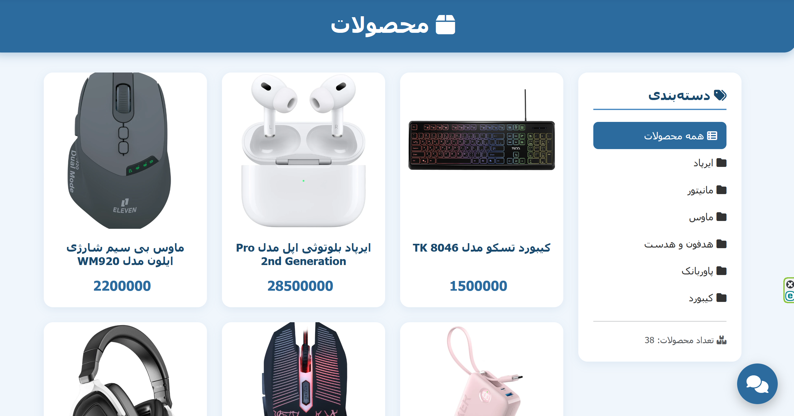
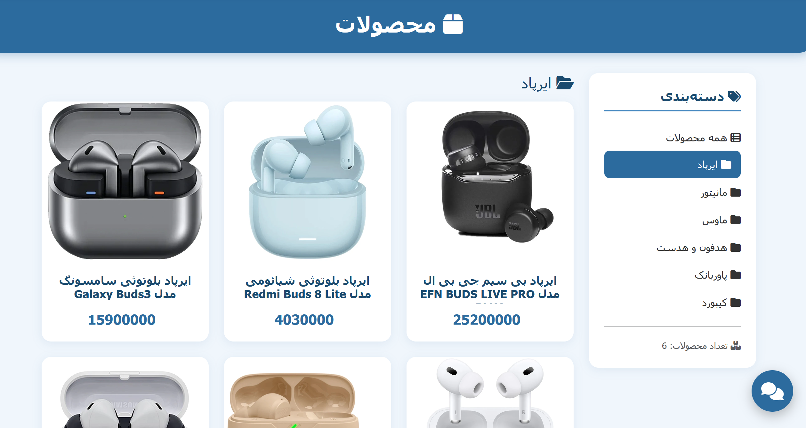
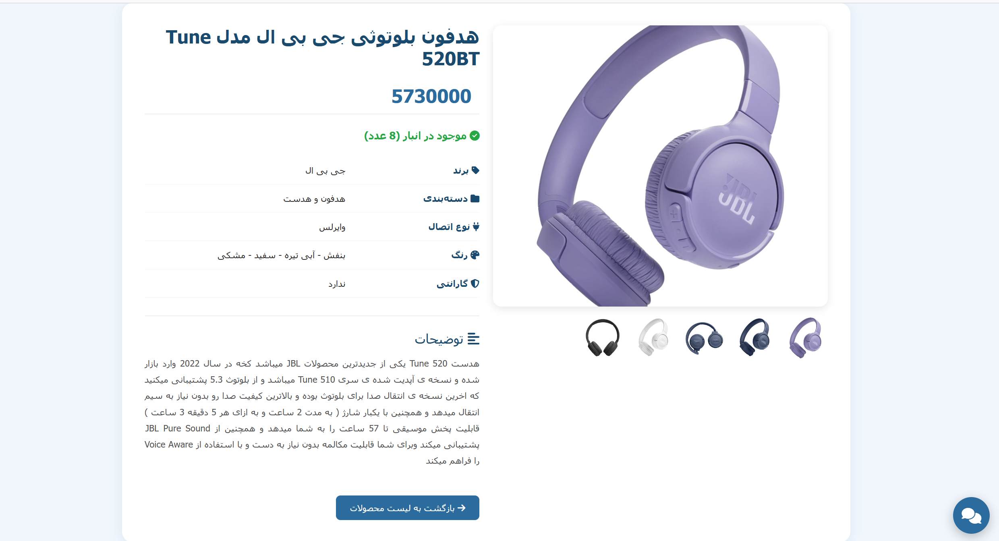
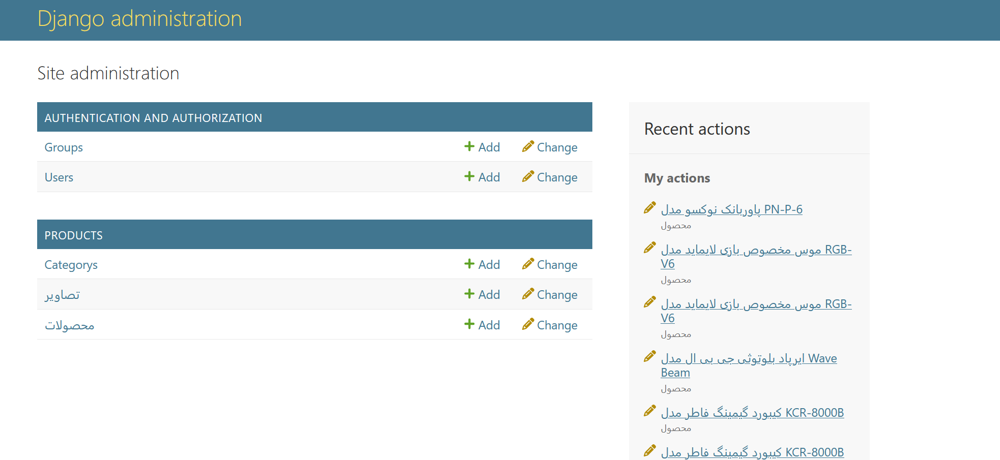
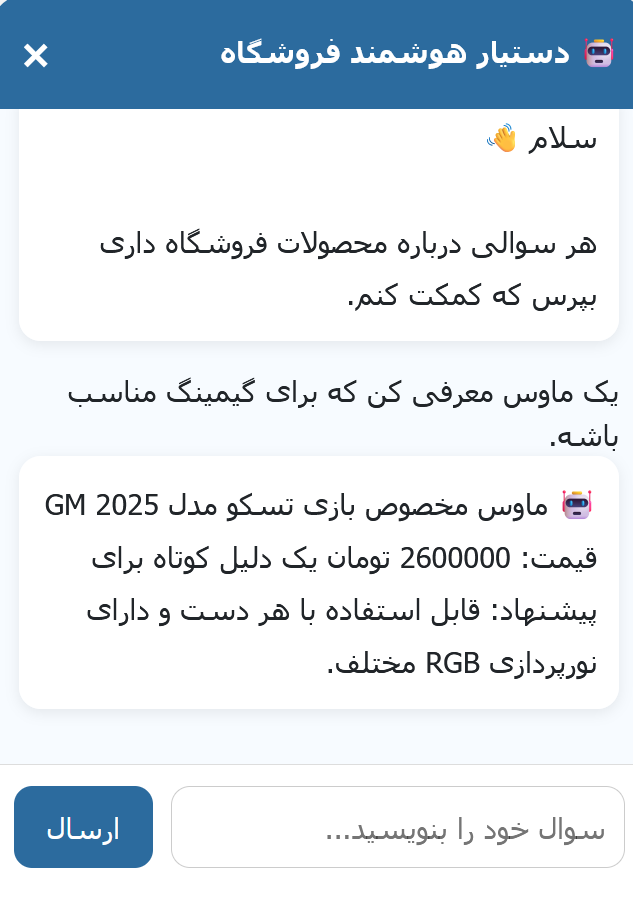
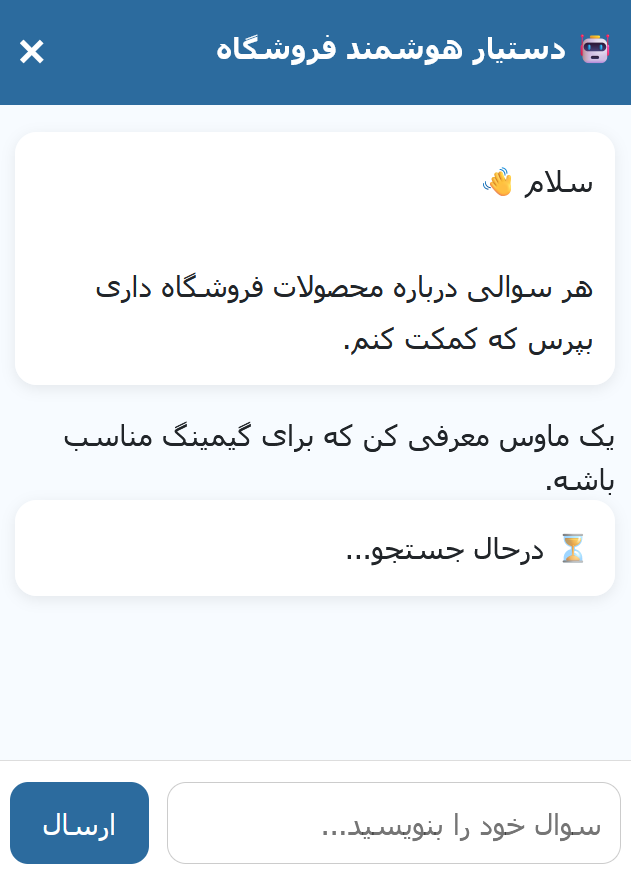

# 🛒 پیاده سازی دستیار هوشمند برای وب‌سایت فروش با استفاده از مدل زبانی محلی
## معرفی پروژه

این پروژه با هدف طراحی و پیاده‌سازی یک **دستیار هوشمند فارسی** برای وب‌سایت فروش تجهیزات جانبی کامپیوتر توسعه داده شده است.

سیستم با استفاده از معماری **Retrieval Augmented Generation (RAG)**، اطلاعات محصولات را از پایگاه داده فروشگاه بازیابی کرده و سپس با کمک یک مدل زبانی محلی (LLM)، پاسخ مناسب و طبیعی را به کاربر ارائه می‌دهد.

از آنجا که تمامی پردازش‌ها به صورت محلی انجام می‌شوند، پروژه هیچ وابستگی به سرویس‌های ابری یا اینترنت بین‌الملل ندارد و می‌تواند حتی درصورت اختلال اینترنت بین‌الملل، فعالیت کند.



---

# اهداف پروژه

* پیاده سازی یک سایت فروشگاهی ساده با جنگو
* پیاده‌سازی یک دستیار هوشمند فارسی
* اجرای پروژه به صورت آفلاین و استفاده از مدل زبانی محلی
* اتصال سیستم هوش مصنوعی به فروشگاه
* جستجوی معنایی محصولات با استفاده از Embedding
* پاسخ‌دهی طبیعی به پرسش‌های کاربران


---

# تکنولوژی‌های استفاده شده

| بخش             | تکنولوژی                              |
| --------------- | ------------------------------------- |
| Backend         | Django                                |
| Language        | Python                                |
| Database        | SQLite                                |
| Vector Database | ChromaDB                              |
| LLM Runtime     | Ollama                                |
| Language Model  | Qwen2.5:3B                            |
| Embedding Model | paraphrase-multilingual-mpnet-base-v2 |
| RAG Framework   | LangChain                             |

---

# ساختار پروژه

```
shop/
│
├── products/
|   ├── admin.py
|   ├── apps.py
│   ├── models.py
│   ├── urls.py
│   ├── views.py
│   └── templates/
│
├── rag/
│   ├── chat.py
│   ├── embedding.py
│   ├── llm.py
│   ├── loader.py
│   ├── prompt_builder.py
│   ├── retriever.py
│   ├── service.py
│   ├── signals.py
│   ├── update_vectorstore.py
│   └── vectorstore.py
│
│
├── media/
│
└── shop/
```

---

# نحوه کار سیستم

1. کاربر سوال خود را وارد می‌کند.
2. سوال به بردار (Embedding) تبدیل می‌شود.
3. محصولات مشابه از Chroma بازیابی می‌شوند.
4. اطلاعات محصولات به Prompt تبدیل می‌شود.
5. پرامپت به مدل ارسال می‌شود.
6. مدل بر اساس اطلاعات بازیابی‌شده پاسخ تولید می‌کند.
7. پاسخ به کاربر نمایش داده می‌شود.

---

# نمونه سوالات

* یک کیبورد گیمینگ معرفی کن.
* مانیتور خمیده موجود دارید؟
* یک ایرپاد سامسونگ پیشنهاد بده.
* موس بی‌سیم مناسب برنامه‌نویسی می‌خواهم.

---

# سایر تصاویر پروژه

در این قسمت چندین عکس از پروژه وجود دارد:


* صفحه اصلی فروشگاه
<p align="center">
  
</p>


* صفحه اصلی فروشگاه با یک دسته بندی خاص
<p align="center">
  
</p>


* صفحه جزئیات محصول
<p align="center">
  
</p>

* پنل مدیریت جنگو
<p align="center">
  
</p>


* نمونه پرسش و پاسخ
<div style="display: flex; justify-content: space-between; align-items: center;">
  <div style="width: 50%;">
    <p align="center">
      
    </p>
  </div>
  <div style="width: 50%;">
    <p align="center">
      
    </p>
  </div>
</div>
